# vLLM Serve 流程图

## 整体流程概览

```mermaid
flowchart TD
    A["<b>CLI 入口</b><br/>vllm serve model_name<br/><i>vllm.entrypoints.cli.main:main()</i>"]
    A --> B["<b>加载子命令模块</b><br/>导入 vllm.entrypoints.cli.serve"]
    B --> C["<b>解析命令行参数</b><br/>ServeSubcommand.subparser_init()<br/>使用 make_arg_parser() 构建参数解析器"]
    C --> D["<b>执行 serve 命令</b><br/>ServeSubcommand.cmd(args)"]

    D --> E{路由模式判断}
    E -->|"无 API Server<br/>(headless)"| F["run_headless(args)"]
    E -->|"多 API Server"| G["run_multi_api_server(args)"]
    E -->|"单 API Server<br/>(默认)"| H["uvloop.run(run_server(args))"]

    H --> I["<b>服务器设置</b><br/>setup_server(args)<br/><i>api_server.py</i>"]
    I --> I1["验证参数"]
    I1 --> I2["创建 TCP/Unix Socket<br/>绑定 host:port"]
    I2 --> J["<b>构建引擎客户端</b><br/>build_async_engine_client(args)"]

    J --> K["<b>创建引擎配置</b><br/>AsyncEngineArgs.from_cli_args(args)<br/>engine_args.create_engine_config()"]

    K --> K1["<b>VllmConfig 包含:</b><br/>ModelConfig / ParallelConfig<br/>CacheConfig / SchedulerConfig<br/>ExecutorConfig"]

    K1 --> L["<b>选择 Executor 类</b><br/>Executor.get_class(vllm_config)<br/><i>v1/executor/abstract.py</i>"]

    L --> L1{Executor 类型}
    L1 -->|"mp (默认)"| L2["MultiprocExecutor"]
    L1 -->|"ray"| L3["RayDistributedExecutor"]
    L1 -->|"uni"| L4["UniProcExecutor"]

    L2 --> M
    L3 --> M
    L4 --> M

    M["<b>创建 AsyncLLM</b><br/>AsyncLLM.from_vllm_config()<br/><i>v1/engine/async_llm.py</i>"]

    M --> M1["初始化 InputProcessor<br/>初始化 OutputProcessor"]
    M1 --> M2["<b>创建 EngineCoreClient</b><br/>make_async_mp_client()<br/><i>v1/engine/core_client.py</i>"]

    M2 --> N{数据并行模式}
    N -->|"单引擎 (默认)"| N1["AsyncMPClient"]
    N -->|"外部负载均衡"| N2["DPAsyncMPClient"]
    N -->|"内部负载均衡"| N3["DPLBAsyncMPClient"]

    N1 --> O
    N2 --> O
    N3 --> O

    O["<b>启动 EngineCore 进程</b><br/>launch_core_engines()<br/><i>v1/engine/utils.py</i>"]

    O --> P["<b>EngineCore 初始化</b><br/><i>v1/engine/core.py</i>"]

    P --> P1["<b>创建 Executor 实例</b><br/>executor_class(vllm_config)<br/>生成 Worker 进程"]
    P1 --> P2["<b>Worker 加载模型权重</b><br/>每个 GPU 一个 Worker"]
    P2 --> P3["<b>初始化 KV Cache</b><br/>_initialize_kv_caches()<br/>· 分析 GPU 可用内存<br/>· 分配 KV Cache 块<br/>· 模型执行预热"]
    P3 --> P4["<b>创建 Scheduler</b><br/>Scheduler(vllm_config, ...)<br/>请求批处理调度"]
    P4 --> P5["冻结 GC 堆 / 优化性能"]

    P5 --> Q["<b>等待引擎就绪</b><br/>ZMQ READY 消息<br/>VLLM_ENGINE_READY_TIMEOUT_S"]

    Q --> R["<b>构建 FastAPI 应用</b><br/>build_app(args, supported_tasks)<br/><i>api_server.py</i>"]

    R --> R1["<b>注册 API 路由</b><br/>· /v1/models<br/>· /v1/chat/completions<br/>· /v1/completions<br/>· /v1/embeddings<br/>· Sagemaker / gRPC 等"]
    R1 --> R2["<b>添加中间件</b><br/>CORS / Auth / Metrics<br/>Scaling / 异常处理"]

    R2 --> S["<b>初始化应用状态</b><br/>init_app_state()<br/><i>api_server.py</i>"]
    S --> S1["OpenAIServingModels<br/>OpenAIServingTokenization<br/>各任务 Handler<br/>(Chat/Completion/Embedding...)"]

    S1 --> T["<b>启动 HTTP 服务</b><br/>serve_http(app, sock, args)<br/><i>launcher.py</i>"]

    T --> T1["创建 Uvicorn Config & Server"]
    T1 --> T2["启动并行任务"]

    T2 --> U1["<b>Uvicorn Server Loop</b><br/>server.serve()<br/>监听 HTTP 请求"]
    T2 --> U2["<b>Watchdog Loop</b><br/>watchdog_loop()<br/>每 5s 检查引擎健康"]
    T2 --> U3["<b>信号处理</b><br/>SIGINT / SIGTERM<br/>优雅关闭"]

    style A fill:#4CAF50,color:#fff
    style D fill:#2196F3,color:#fff
    style M fill:#FF9800,color:#fff
    style P fill:#9C27B0,color:#fff
    style R fill:#E91E63,color:#fff
    style T fill:#00BCD4,color:#fff
    style U1 fill:#8BC34A,color:#fff
    style U2 fill:#FFC107,color:#000
    style U3 fill:#FF5722,color:#fff
```

## 请求处理流程 (运行时)

```mermaid
flowchart LR
    subgraph "HTTP 层"
        A["客户端请求<br/>/v1/chat/completions"]
        B["FastAPI Handler"]
    end

    subgraph "AsyncLLM 层"
        C["InputProcessor<br/>请求预处理"]
        D["EngineCoreClient<br/>ZMQ ROUTER Socket"]
    end

    subgraph "EngineCore 进程"
        E["ZMQ 接收请求"]
        F["Scheduler<br/>批处理调度"]
        G["Executor<br/>执行批次"]
    end

    subgraph "Worker 进程 (GPU)"
        H["加载 Batch 到 GPU"]
        I["模型前向推理"]
        J["返回 Token 输出"]
    end

    subgraph "响应路径"
        K["ZMQ PULL Socket<br/>接收输出"]
        L["OutputProcessor<br/>响应后处理"]
        M["SSE 流式响应<br/>或完整响应"]
    end

    A --> B --> C --> D --> E --> F --> G --> H --> I --> J
    J --> K --> L --> M --> A

    style A fill:#4CAF50,color:#fff
    style F fill:#9C27B0,color:#fff
    style I fill:#FF9800,color:#fff
    style M fill:#2196F3,color:#fff
```

## 关键文件路径

| 阶段 | 文件 | 核心函数/类 |
|------|------|------------|
| CLI 入口 | `vllm/entrypoints/cli/main.py` | `main()` |
| Serve 命令 | `vllm/entrypoints/cli/serve.py` | `ServeSubcommand.cmd()` |
| 参数解析 | `vllm/entrypoints/openai/cli_args.py` | `make_arg_parser()` |
| 引擎配置 | `vllm/engine/arg_utils.py` | `AsyncEngineArgs.create_engine_config()` |
| API 服务 | `vllm/entrypoints/openai/api_server.py` | `run_server()`, `build_app()`, `init_app_state()` |
| AsyncLLM | `vllm/v1/engine/async_llm.py` | `AsyncLLM.from_vllm_config()` |
| 引擎核心客户端 | `vllm/v1/engine/core_client.py` | `AsyncMPClient` |
| 引擎核心 | `vllm/v1/engine/core.py` | `EngineCore.__init__()` |
| Executor | `vllm/v1/executor/abstract.py` | `Executor.get_class()` |
| 多进程 Executor | `vllm/v1/executor/multiproc_executor.py` | `MultiprocExecutor` |
| HTTP 启动 | `vllm/entrypoints/launcher.py` | `serve_http()`, `watchdog_loop()` |
