# LLM.__init__ 初始化流程泳道图

> 源文件: `vllm/entrypoints/llm.py` 第 306-505 行

```mermaid
flowchart TD
    subgraph 用户调用
        A["LLM(model, **kwargs)"]
    end

    subgraph 参数验证与废弃处理
        B{"kwargs 中有<br/>swap_space?"}
        B -- 是 --> C["移除 swap_space<br/>发出 DeprecationWarning"]
        B -- 否 --> D{"kwargs 中有<br/>disable_log_stats?"}
        C --> D
        D -- 否 --> E["设置 disable_log_stats = True"]
        D -- 是 --> F{"kwargs 中有<br/>worker_cls?"}
        E --> F
        F -- 是且为类对象 --> G["cloudpickle.dumps(worker_cls)<br/>序列化 worker 类"]
        F -- 否 --> H{"kwargs 中有<br/>kv_transfer_config<br/>且为 dict?"}
        G --> H
    end

    subgraph KV传输配置转换
        H -- 是 --> I["导入 KVTransferConfig"]
        I --> J["KVTransferConfig(**dict)"]
        J -- ValidationError --> K["抛出 ValueError"]
        J -- 成功 --> L["hf_overrides 处理"]
        H -- 否 --> L
    end

    subgraph 配置对象构建
        L --> L1{"hf_overrides<br/>is None?"}
        L1 -- 是 --> L2["hf_overrides = {}"]
        L1 -- 否 --> M["定义 _make_config() 辅助函数<br/>将 dict/None/实例统一转为配置对象"]
        L2 --> M

        M --> N{"compilation_config<br/>是 int?"}
        N -- 是 --> O["CompilationConfig(<br/>mode=CompilationMode(int))"]
        N -- 否 --> P["_make_config(<br/>compilation_config,<br/>CompilationConfig)"]

        O --> Q["_make_config → StructuredOutputsConfig"]
        P --> Q
        Q --> R["_make_config → ProfilerConfig"]
        R --> S["_make_config → AttentionConfig"]
    end

    subgraph 数据并行校验
        S --> T{"data_parallel_size > 1<br/>且非 external_launcher<br/>且非 TPU?"}
        T -- 是 --> U["抛出 ValueError:<br/>单进程不支持数据并行"]
        T -- 否 --> V["继续"]
    end

    subgraph EngineArgs构建
        V --> W["创建 EngineArgs(<br/>  model, runner, convert,<br/>  tokenizer, dtype, quantization,<br/>  tensor_parallel_size,<br/>  gpu_memory_utilization,<br/>  compilation_config_instance,<br/>  attention_config_instance,<br/>  ... 所有配置参数<br/>)"]
        W --> X["log_non_default_args(engine_args)<br/>记录非默认参数"]
    end

    subgraph LLMEngine创建
        X --> Y["【从参数构建LLMEngine】<br/> <br/> LLMEngine.from_engine_args(engine_args,usage_context=LLM_CLASS)"]
        Y --> Z["【设置LLM对象的llm_engine属性为刚刚创建的LLMEngine对象】<br/><br/> self.llm_engine = engine"]
        Z --> Z1["【记录engine的类型】<br/><br/> self.engine_class = type(engine)"]
    end

    subgraph 实例属性初始化
        Z1 --> AA["self.request_counter = Counter()"]
        AA --> AB["self.default_sampling_params = None"]
        AB --> AC["supported_tasks =<br/>llm_engine.get_supported_tasks()"]
        AC --> AD["logger.info 记录支持的任务"]
        AD --> AE["self.model_config =<br/>llm_engine.model_config"]
        AE --> AF["self.renderer =<br/>llm_engine.renderer"]
        AF --> AG["self.chat_template =<br/>load_chat_template(chat_template)"]
        AG --> AH["self.io_processor =<br/>llm_engine.io_processor"]
        AH --> AI["self.input_processor =<br/>llm_engine.input_processor"]
        AI --> AJ["self.chat_template_config =<br/>ChatTemplateConfig(...)"]
        AJ --> AK["self.pooling_io_processors =<br/>init_pooling_io_processors(...)"]
        AK --> AL["self._cached_repr = None"]
    end

    A --> B
    AL --> END["初始化完成 ✓"]
```

## 泳道说明

| 泳道 | 职责 | 代码行 |
|------|------|--------|
| **用户调用** | 入口点，用户传入 model 和其他参数 | 306-347 |
| **参数验证与废弃处理** | 处理废弃参数、序列化 worker_cls | 350-370 |
| **KV传输配置转换** | 将 kv_transfer_config 字典转为 KVTransferConfig 对象 | 372-393 |
| **配置对象构建** | 用 `_make_config()` 统一转换各类配置 | 395-418 |
| **数据并行校验** | 检查数据并行配置的合法性 | 420-434 |
| **EngineArgs构建** | 汇总所有参数创建 EngineArgs 对象 | 436-474 |
| **LLMEngine创建** | 调用 `LLMEngine.from_engine_args()` 创建推理引擎 | 477-482 |
| **实例属性初始化** | 从引擎获取各组件并保存为实例属性 | 484-505 |

## 关键依赖关系

- **EngineArgs** 依赖所有配置对象构建完成
- **LLMEngine** 依赖 EngineArgs 构建完成
- **实例属性**（model_config, renderer 等）依赖 LLMEngine 创建完成
- `_make_config()` 是核心辅助函数，负责 `dict → Config 对象` 的统一转换
