# LLMEngine.__init__ 初始化流程泳道图

> 源文件: `vllm/v1/engine/llm_engine.py` 第 58-147 行
> 工厂方法: `from_engine_args()` 第 168-194 行，`from_vllm_config()` 第 150-165 行

## 入口：from_engine_args（由 LLM.__init__ 调用）

```mermaid
flowchart TD
    subgraph 工厂方法_from_engine_args
        FA["LLMEngine.from_engine_args(<br/>engine_args, usage_context)"]
        FA --> FB["vllm_config =<br/>engine_args.create_engine_config(usage_context)<br/>根据引擎参数创建引擎配置"]
        FB --> FC["executor_class =<br/>Executor.get_class(vllm_config)<br/>根据配置选择执行器类"]
        FC --> FD{"VLLM_ENABLE_V1<br/>_MULTIPROCESSING?"}
        FD -- 是 --> FE["enable_multiprocessing = True"]
        FD -- 否 --> FF["保持原值"]
        FE --> FG["调用 cls.__init__()"]
        FF --> FG
    end

    subgraph 配置保存
        FG --> A["self.vllm_config = vllm_config"]
        A --> B["self.model_config = vllm_config.model_config"]
        B --> C["self.observability_config =<br/>vllm_config.observability_config"]
    end

    subgraph 追踪初始化
        C --> D{"tracing_endpoint<br/>不为 None?"}
        D -- 是 --> E["init_tracer('vllm.llm_engine',<br/>tracing_endpoint)<br/>初始化 OpenTelemetry 追踪器"]
        D -- 否 --> F["跳过"]
        E --> G["self.log_stats = log_stats"]
        F --> G
    end

    subgraph 数据并行组初始化
        G --> H["获取 parallel_config<br/>和 executor_backend"]
        H --> I["self.external_launcher_dp =<br/>(dp_size > 1 且为 external_launcher)"]
        I --> J{"非多进程模式<br/>且 dp_size > 1<br/>且非 external_launcher?"}
        J -- 是 --> K["self.dp_group =<br/>parallel_config.stateless_init_dp_group()<br/>初始化无状态数据并行组"]
        J -- 否 --> L["self.dp_group = None"]
        K --> M["self.should_execute_dummy_batch = False"]
        L --> M
    end

    subgraph 处理器创建
        M --> N["【渲染器】<br/>self.renderer =<br/>renderer_from_config(vllm_config)"]
        N --> O["【IO处理器】<br/>self.io_processor =<br/>get_io_processor(<br/>  vllm_config, renderer,<br/>  io_processor_plugin<br/>)"]
        O --> P["【输入处理器】<br/>self.input_processor =<br/>InputProcessor(vllm_config, renderer)<br/>TokPrompt → EngineCoreRequest"]
        P --> Q["【输出处理器】<br/>self.output_processor =<br/>OutputProcessor(<br/>  tokenizer, log_stats,<br/>  stream_interval, tracing_enabled<br/>)<br/>EngineCoreOutputs → RequestOutput"]
    end

    subgraph 引擎核心创建
        Q --> R["【引擎核心客户端】<br/><br/>self.engine_core =EngineCoreClient.make_client(multiprocess_mode,asyncio_mode=False,<br/>  vllm_config, executor_class,<br/>  log_stats<br/>)"]
    end

    subgraph 统计日志初始化
        R --> S{"self.log_stats<br/>为 True?"}
        S -- 是 --> T["self.logger_manager =<br/>StatLoggerManager(<br/>  vllm_config,<br/>  custom_stat_loggers,<br/>  enable_default_loggers,<br/>  aggregate_engine_logging<br/>)"]
        T --> U["logger_manager.log_engine_initialized()<br/>记录引擎初始化完成日志"]
        S -- 否 --> V["self.logger_manager = None"]
        U --> W["继续"]
        V --> W
    end

    subgraph 兼容性与清理
        W --> X{"非多进程模式?"}
        X -- 是 --> Y["self.model_executor =<br/>engine_core.engine_core.model_executor<br/>为 v0 兼容性设置执行器引用"]
        X -- 否 --> Z{"external_launcher_dp?"}
        Y --> Z
        Z -- 是 --> AA["self.dp_group =<br/>get_dp_group().cpu_group<br/>复用已有的数据并行通信组"]
        Z -- 否 --> AB["self.reset_mm_cache()<br/>重置多模态缓存，释放虚拟数据"]
        AA --> AB
    end

    AB --> END["LLMEngine 初始化完成 ✓"]
```



## 泳道说明

| 泳道 | 职责 | 代码行 |
|------|------|--------|
| **工厂方法** | 从 EngineArgs 创建 VllmConfig 和 Executor 类，决定是否多进程 | 168-194 |
| **配置保存** | 保存 vllm_config、model_config、observability_config | 70-72 |
| **追踪初始化** | 如有 OTLP 端点则初始化 OpenTelemetry 追踪器 | 74-78 |
| **数据并行组初始化** | 根据并行配置决定是否创建 DP group | 80-97 |
| **处理器创建** | 创建渲染器、IO处理器、输入处理器、输出处理器四大组件 | 99-115 |
| **引擎核心创建** | 通过 EngineCoreClient.make_client 创建核心推理引擎 | 117-125 |
| **统计日志初始化** | 如启用统计则创建 StatLoggerManager | 127-135 |
| **兼容性与清理** | v0 兼容性处理、DP group 复用、多模态缓存清理 | 137-147 |

## 核心组件关系

```
LLMEngine.__init__
  ├── renderer          ← renderer_from_config()     渲染器（分词+模板）
  ├── io_processor      ← get_io_processor()         IO 预处理
  ├── input_processor   ← InputProcessor()           提示词 → EngineCoreRequest
  ├── output_processor  ← OutputProcessor()          EngineCoreOutputs → RequestOutput
  ├── engine_core       ← EngineCoreClient.make_client()  核心推理引擎
  └── logger_manager    ← StatLoggerManager()        统计日志
```

## 调用链路

```
LLM.__init__()
  └── LLMEngine.from_engine_args(engine_args)
        ├── engine_args.create_engine_config()  → VllmConfig
        ├── Executor.get_class(vllm_config)     → executor_class
        └── LLMEngine.__init__(vllm_config, executor_class, ...)
```
