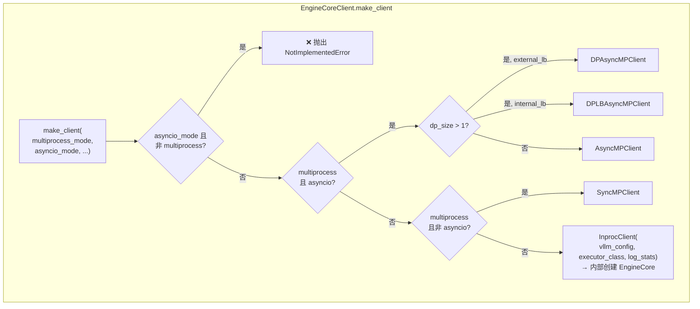

# EngineCore 初始化流程泳道图

> 源文件: `vllm/v1/engine/core.py` 第 85-222 行
> 客户端入口: `vllm/v1/engine/core_client.py`

## 调用链路

```
LLMEngine.__init__()
  └── EngineCoreClient.make_client(multiprocess_mode, asyncio_mode=False, ...)
        ├── multiprocess + async  → DPAsyncMPClient / DPLBAsyncMPClient / AsyncMPClient
        ├── multiprocess + sync   → SyncMPClient
        └── inproc (默认)          → InprocClient
                                       └── EngineCore.__init__()   ← 本图重点
```

## make_client 工厂方法选择逻辑



## EngineCore.__init__ 完整泳道图

```mermaid
flowchart TD
    subgraph 插件加载与配置保存
        A["EngineCore.__init__(<br/>vllm_config, executor_class, log_stats)"]
        A --> B["load_general_plugins()<br/>加载通用插件"]
        B --> C["self.vllm_config = vllm_config"]
        C --> D["logger.info 记录引擎版本和配置"]
        D --> E["self.log_stats = log_stats"]
    end

    subgraph 模型执行器创建
        E --> F["【创建模型执行器】<br/>self.model_executor =<br/>executor_class(vllm_config)"]
        F --> G{"executor_fail_callback<br/>不为 None?"}
        G -- 是 --> H["注册执行器失败回调"]
        G -- 否 --> I["继续"]
        H --> I
    end

    subgraph KV缓存初始化
        I --> J{"VLLM_ELASTIC_EP<br/>_SCALE_UP_LAUNCH?"}
        J -- 是 --> K["_eep_scale_up_before_kv_init()<br/>弹性专家并行扩容"]
        J -- 否 --> L["_initialize_kv_caches()"]
        K --> L

        L --> L1["kv_cache_specs =<br/>model_executor.get_kv_cache_specs()<br/>获取KV缓存规格"]
        L1 --> L2{"有 KV 缓存?"}
        L2 -- 是 --> L3["available_gpu_memory =<br/>model_executor.determine_available_memory()<br/>分析峰值内存确定可用空间"]
        L2 -- 否 --> L4["available_gpu_memory = [0] * N"]
        L3 --> L5["kv_cache_configs =<br/>get_kv_cache_configs(...)<br/>计算KV缓存配置"]
        L4 --> L5
        L5 --> L6{"max_model_len<br/>被自动调整?"}
        L6 -- 是 --> L7["collective_rpc 同步新值到工作进程"]
        L6 -- 否 --> L8["生成 scheduler_kv_cache_config"]
        L7 --> L8
        L8 --> L9["model_executor.initialize_from_config(<br/>kv_cache_configs)<br/>初始化KV缓存并预热模型"]
    end

    subgraph 结构化输出管理器
        L9 --> M["self.structured_output_manager =<br/>StructuredOutputManager(vllm_config)"]
    end

    subgraph 调度器创建
        M --> N["Scheduler = scheduler_config.get_scheduler_cls()<br/>获取调度器类"]
        N --> N1{"无KV缓存组<br/>且启用了分块预填充?"}
        N1 -- 是 --> N2["警告并禁用分块预填充"]
        N1 -- 否 --> N3["计算 scheduler_block_size =<br/>block_size × decode_cp × prefill_cp"]
        N2 --> N3
        N3 --> O["【创建调度器】<br/>self.scheduler = Scheduler(<br/>  vllm_config, kv_cache_config,<br/>  structured_output_manager,<br/>  block_size, ...<br/>)"]
        O --> P["self.use_spec_decode =<br/>(speculative_config is not None)"]
        P --> P1{"scheduler.connector<br/>不为 None?"}
        P1 -- 是 --> P2["model_executor.init_kv_output_aggregator(<br/>scheduler.connector)"]
        P1 -- 否 --> Q["继续"]
        P2 --> Q
    end

    subgraph 多模态与KV连接器
        Q --> R["self.mm_receiver_cache =<br/>mm_registry.engine_receiver_cache_from_config(...)"]
        R --> S{"scheduler.get_kv_connector()<br/>不为 None?"}
        S -- 是 --> T["从工作进程收集 KV 连接器<br/>传输握手元数据"]
        T --> U["合并所有工作进程的元数据字典"]
        U --> V["kv_connector.set_xfer_handshake_metadata(content)"]
        S -- 否 --> W["继续"]
        V --> W
    end

    subgraph 批次队列与哈希器
        W --> X["batch_queue_size =<br/>model_executor.max_concurrent_batches"]
        X --> X1{"batch_queue_size > 1?"}
        X1 -- 是 --> X2["self.batch_queue =<br/>deque(maxlen=batch_queue_size)<br/>启用流水线并行批次队列"]
        X1 -- 否 --> X3["self.batch_queue = None"]
        X2 --> Y["判断 is_ec_consumer / is_pooling_model"]
        X3 --> Y
        Y --> Z{"启用前缀缓存<br/>或有KV连接器?"}
        Z -- 是 --> Z1["获取缓存哈希函数<br/>init_none_hash()<br/>创建 request_block_hasher"]
        Z -- 否 --> Z2["request_block_hasher = None"]
        Z1 --> AA["选择 step_fn"]
        Z2 --> AA
    end

    subgraph 性能优化收尾
        AA --> AB["step_fn = step 或<br/>step_with_batch_queue"]
        AB --> AC["self.async_scheduling =<br/>scheduler_config.async_scheduling"]
        AC --> AD["self.aborts_queue = Queue()"]
        AD --> AE["freeze_gc_heap()<br/>冻结GC堆减少GC暂停"]
        AE --> AF["maybe_attach_gc_debug_callback()"]
        AF --> AG["enable_envs_cache()<br/>启用环境变量缓存"]
    end

    AG --> END["EngineCore 初始化完成 ✓"]
```



## 泳道说明

| 泳道 | 职责 | 代码行 |
|------|------|--------|
| **插件加载与配置保存** | 加载通用插件，保存基础配置 | 96-109 |
| **模型执行器创建** | `executor_class(vllm_config)` 创建执行器 | 112-114 |
| **KV缓存初始化** | 内存分析 → 计算缓存配置 → 初始化缓存并预热 | 116-282 |
| **结构化输出管理器** | 创建 StructuredOutputManager | 123 |
| **调度器创建** | 选择调度器类、计算块大小、创建调度器实例 | 126-151 |
| **多模态与KV连接器** | 多模态缓存 + KV连接器握手元数据交换 | 153-177 |
| **批次队列与哈希器** | 流水线并行批次队列 + 前缀缓存哈希器 | 182-209 |
| **性能优化收尾** | 冻结GC堆、启用环境变量缓存 | 210-222 |

## 核心组件

```
EngineCore
  ├── model_executor          ← executor_class(vllm_config)       模型执行器
  ├── scheduler               ← Scheduler(vllm_config, ...)       请求调度器
  ├── structured_output_manager ← StructuredOutputManager(...)     结构化输出
  ├── mm_receiver_cache       ← mm_registry 多模态接收器缓存
  ├── batch_queue             ← deque (流水线并行用)
  ├── request_block_hasher    ← 前缀缓存哈希器
  └── step_fn                 ← step / step_with_batch_queue
```
